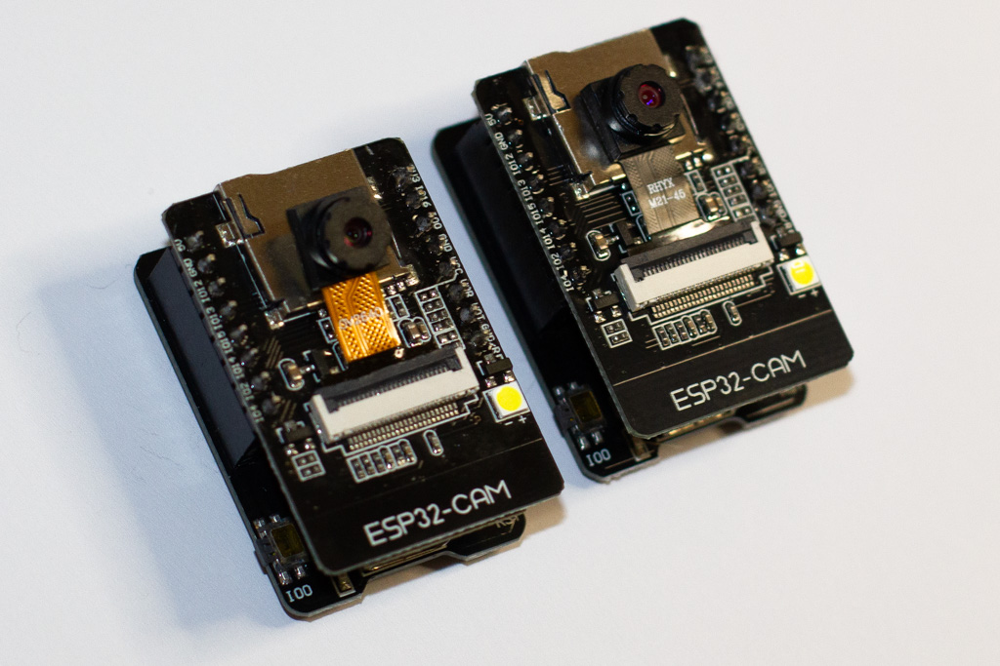

# ESP32-CAM

#### Arduino Example
https://github.com/espressif/arduino-esp32/blob/master/libraries/ESP32/examples/Camera/CameraWebServer/CameraWebServer.ino

### Hardware
- Board ESP32-CAM-MB adapter serial to USB
- Board ESP32-CAM contain the ESP-32S chip

#### Compatible cams

- OV2640 Cam
- OV7670 Cam
- GC2145 Cam
- RHYX M21-45 Support no compression (RHYX M21-45 it is: GC2145 frame 1600 V x 1200 H 2MP) the trassive time is too long use only 

| Image Sensor | Manufacture | Synonyms           | Megapixel | Frame-size  | fps |
|--------------|-------------|--------------------|-----------|-------------|-----|
| OV2640       | -           |                    | 2 MP      | 1632 x 1232 | 15  |
| OV7670       | -           | XH-OVSLSZ-AV1.0 DM | 0.3 MP    | 640 x 480   | 30  |
| GC2145       | -           | RHYX M21-45        | 2 MP      | 1600 x 1200 | 15  |

#### RHYX M21-45
Use the example from above and set config.pixel_format = PIXFORMAT_RGB565; // JPEG compression not supportet ignore errors in serial monitor use small resolution in video modus.

##### Probleme
Manchmal kommt es vor wen man aus Asien das ESP32-CAM Board kauft, dass dann eine Kamera mit der Bezeichnung **RHYX M21-45** dabei ist es handelt sich um eine GC2145 dies führt zu Problemen da sie keine integrierte Kompression hat und das Senden in voll auflösung zu langsam ist.

###### TODO
Upgrade core for GC2145